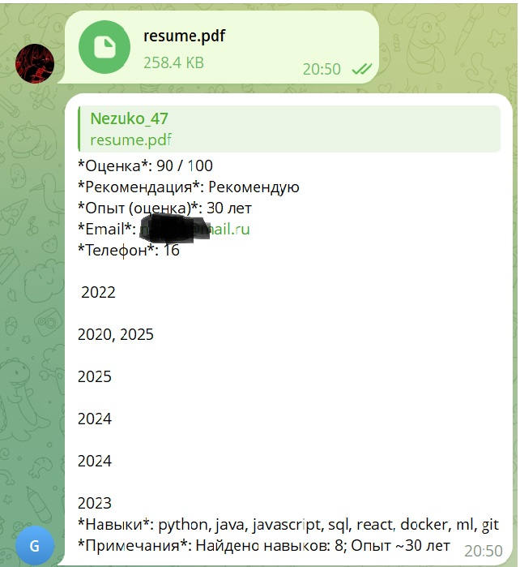

Для успешной реализации любых задач, в том числе в сфере экологии, необходимы квалифицированные специалисты. Разработанное мной решение позволяет автоматизировать отбор резюме по заданным критериям — в частности, оно было успешно применено для поиска программиста, специализирующегося на экологических проектах.

## Моя идея для проекта:
для анализа резюме: загрузка в телеграмм бота файла/текста, извлечение данных, оценка по шаблону, выдача отчёта.
 
Бот в Telegram: токен (BotFather)
-    файл main.py
-     Обработчик команд /start и /help 
-     Приём резюме: .pdf, .docx, .txt, или текст в сообщении.
-     Выдача отчёта в виде краткого сводного ответа и меток (рекомендовано/не рекомендовано/нужны уточнения).
Извлечение текста из файла.
-   файл extract_text.py
-     извлечения текста из PDF.
-     извлечения текста из DOCX.
Правила оценки: наличие контактных данных, опыт >= X лет, релевантные навыки, ключевые слова.
-   файл analysis.py
-     Оценка резюме по простым критериям.
-     Поиск контактных данных: emails и телефоны
- 
